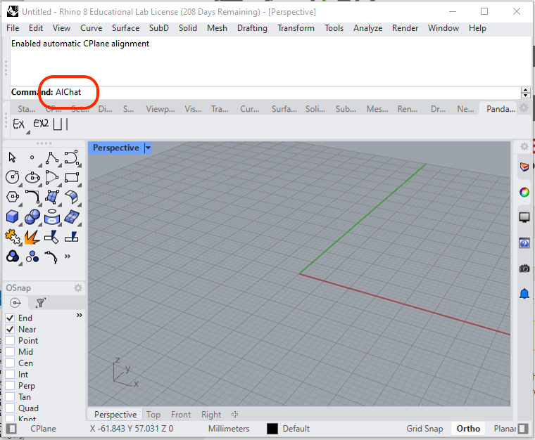
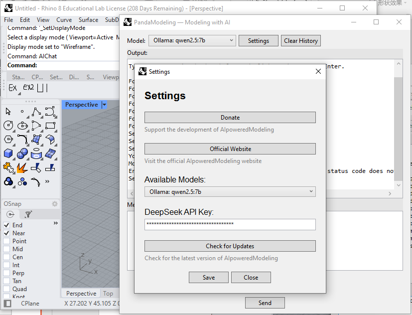

# PandaModeling —— AI Powered Modeling

<div align="center">
  <table>
    <tr>
      <!-- Image 1 -->
      <td></td>
      <!-- Image 3 -->
      <td></td>
    </tr>
  </table>
</div>


This tool uses AI to generate Rhino models.

Download it from [Food4Rhino](https://www.food4rhino.com/en/app/pandamodeling-ai-modeling?lang=en), unzip the .zip file, drag the .rhp file into any opening Rhino window, and type **`AIChat`** in the command, Enter, now you can see the plugin's interface. 

It can use 1) API for advanced cloud _large language models (LLMs)_ or 2) locally installed _LLMs_. You can choose either or both, but the first one is more recommended. The first one is more accurate. The second one hardly works (too many errors because the local models are generally not smart enough).

## 1) Buy an API, using cloud large language models
Generate a DeepSeek API key here: [https://platform.deepseek.com/api_keys](https://platform.deepseek.com/api_keys), copy the API,   
and top up some money in your account: [https://platform.deepseek.com/usage](https://platform.deepseek.com/usage).  
Copy the DeepSeek API to our Plugin (i.e., PandaModeling) using the **`Settings`** button.

## 2) Or, using local models
First, download Ollama: [https://ollama.com](https://ollama.com) and install it.  
Then, use Ollma to install a large language model. Here is an example:

- Open your cmd (Press the Windows key on your keyboard, then type **`cmd`** and you will find it), 
- Type any one of these: 

```shell
ollama run qwen2.5-coder
```
```shell
ollama run llama3
```

## More details will be updated soon.

- [Donations for continuing the development](https://github.com/1309928130/donation/tree/main)
- Contact me: c1309928130@gmail.com
- [Follow on Linkedin](https://www.linkedin.com/me?trk=p_mwlite_feed-secondary_nav)

## FAQs:
[See this page](https://github.com/1309928130/donation/blob/main/FAQs.md)


