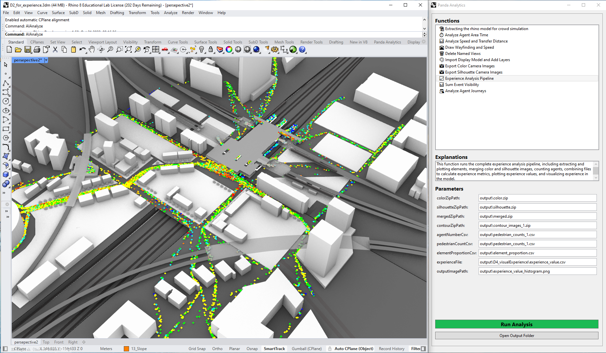
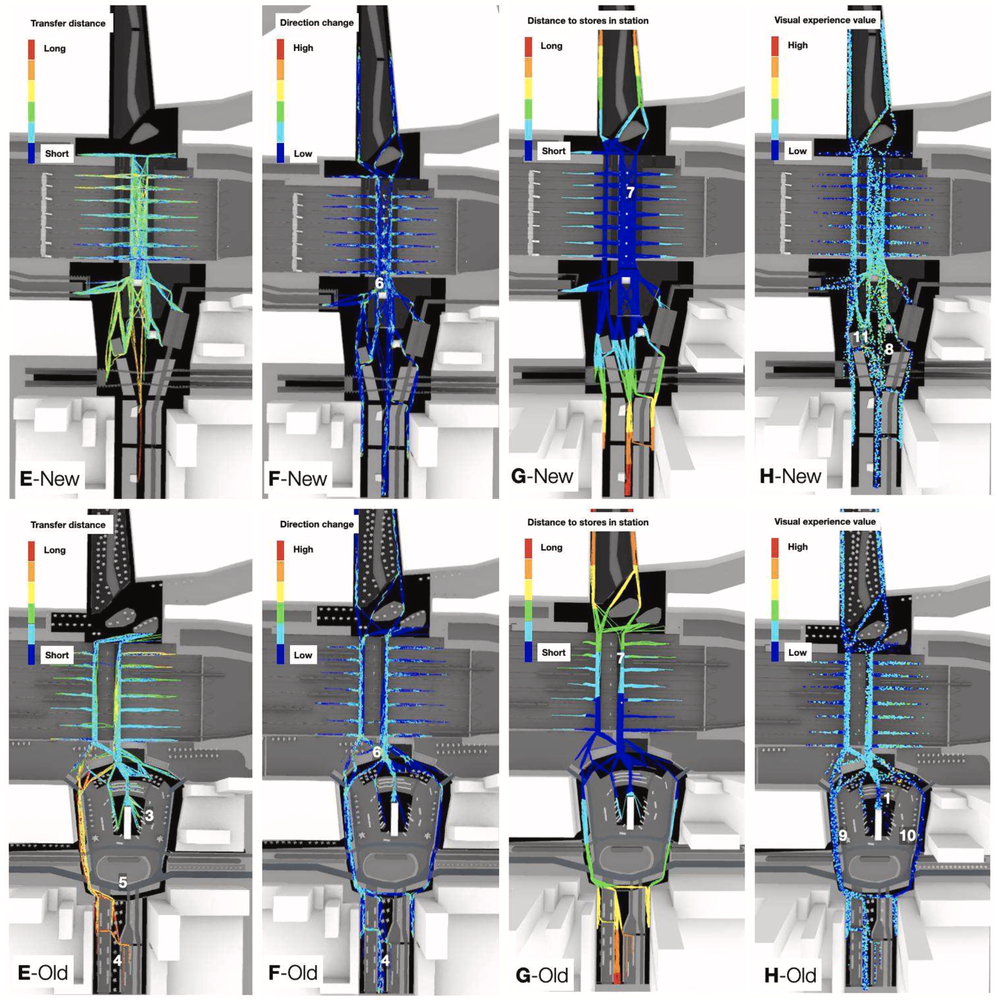

  <h1> PandaAnalytics —— Assess your design proposals </h1>

  <table>
  </table>
    <table>
  </table>
    <table>
  </table>

  <table>
    <tr>
      <!-- Image 1 -->
      <td></td>
    </tr>    
    <tr>
      <!-- Image 1 -->
      <td></td>
    </tr>
  </table>

This tool helps you simulate design proposals and evaluate the possible user experiences in the design proposals (therefore, it also assesses the performances of design proposals). 
The user experiences include:
- Crowd density, 
- Transfer distance, 
- Ease of wayfinding,
- Visual quality.

These experiences are based on two types of simulations: 1) the movement and 2) the vision of the pedestrians (agents).
This plugin originates from a previous research study I did, and the outcome has been published in [this article](https://www.sciencedirect.com/science/article/pii/S0195925524002725).

This plugin is still under development to make it more user-friendly. The current version is not complete yet (some functions are not usable). You need to run the movement simulation using another commercial software, MassMotion. Then, export the agents' trajectories and summary data, and import those data into this plugin. 

The movement simulation function(s) in this plugin is under development. I will update once finished.

## More details will be updated soon.

- [Donations for continuing the development](https://github.com/1309928130/donation/tree/main)
- Contact me: c1309928130@gmail.com
- [Linkedin](https://www.linkedin.com/me?trk=p_mwlite_feed-secondary_nav)

