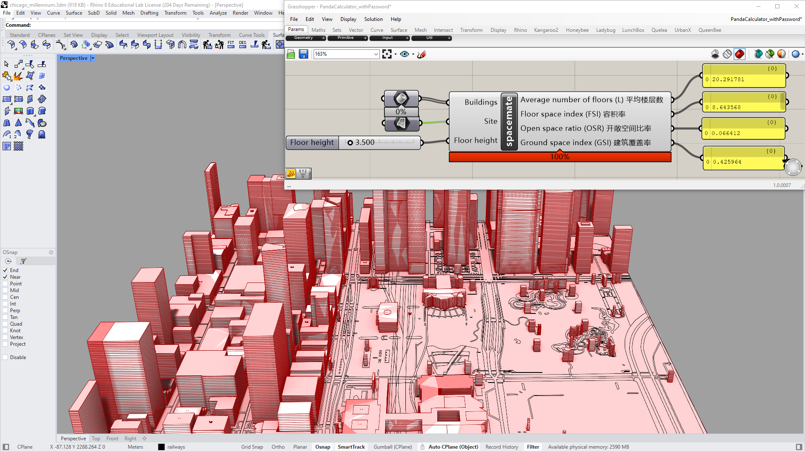
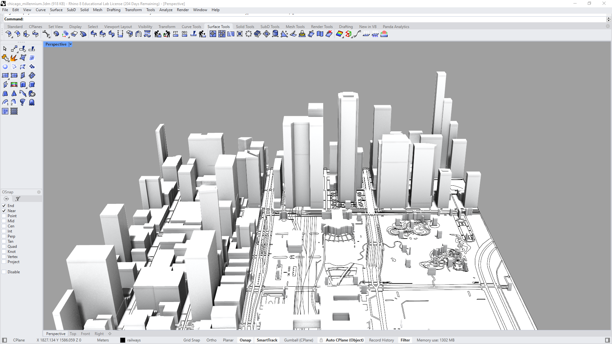

# PandaMeasuring —— Automate the measuring of your models

  <table>
  </table>
    <table>
  </table>
    <table>
  </table>

<!-- Download Section (Centered + Extra Spacing) -->

  
  <a href="http://www.pandaai.vip/" target="_blank" 
     style="font-size: 20px; font-weight: bold; background-color: #f9d71c; color: black; 
            padding: 12px 24px; border-radius: 8px; text-decoration: none; 
            display: inline-block; border: 2px solid #333; margin-top: 20px;">
    🔽 Click Here to Download
  </a>
  
  

    ⚠️ Due to maintenance, the downloading and payment page is temporarily unavailable.
  

  <table>
  </table>
    <table>
  </table>
    <table>
  </table>

  <table>
    <tr>
      <!-- Image 1 -->
      <td></td>
    </tr>
    <tr>
      <!-- Image 2 -->
      <td></td>
    </tr>
  </table>

This tool helps you automatically measure the density-related values.

## More details will be updated soon.

- [Donations for continuing the development](https://github.com/1309928130/donation/tree/main)
- Send messages telling me what other variables you want to measure. I will develop them in the later versions.
- Contact me: c1309928130@gmail.com
- [Linkedin](https://www.linkedin.com/me?trk=p_mwlite_feed-secondary_nav)

